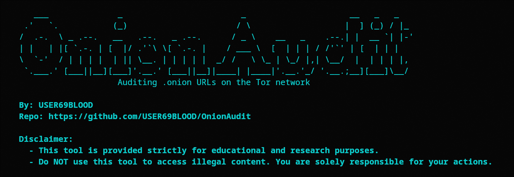
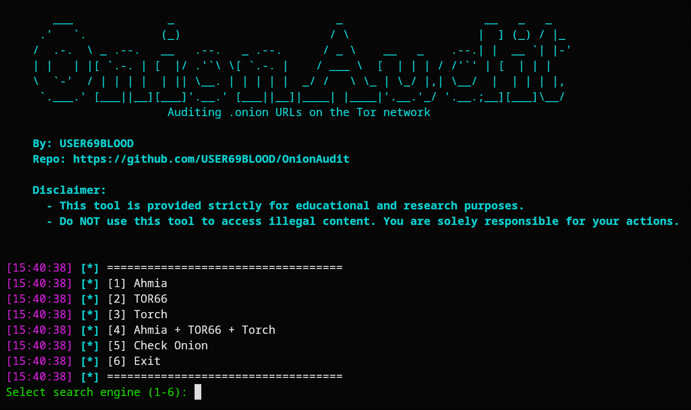
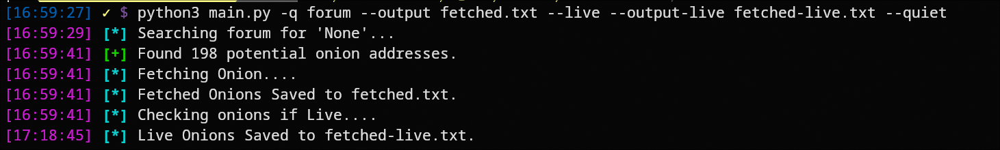
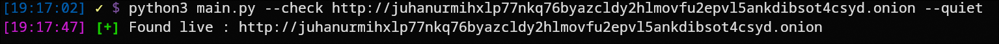

# OnionAudit 🕵️‍♂️

  

**OnionAudit** is a Python-based tool to search, fetch, and verify `.onion` links from popular Dark Web search engines. It supports both interactive and non-interactive CLI modes, making it easy for cybersecurity enthusiasts and researchers to gather onion links and check if they are live.


## Features

- Search for `.onion` links from multiple sources:
  - AHMIA
  - TOR66
  - TORCH
- Validate if `.onion` links are live.
- Save results to files:
  - Fetched onions
  - Live onions
- Supports both **interactive mode** and **CLI mode**.
- Quiet mode to suppress terminal output.
- Handles `.onion` lists from files for bulk live checks.


## Installation

1. **Clone the repository:**
```bash
git clone https://github.com/USER69BLOOD/OnionAudit.git
cd OnionAudit
```

2. **Install dependencies:**
```bash
pip install -r requirements.txt
```

3. **Make sure Tor is running:**
```bash
sudo systemctl start tor
```
> ⚠️ **Note:** The above command works on Linux systems.
>
> **Windows:** Download and run the [Tor Expert Bundle](https://www.torproject.org/download/tor/).
>
> **macOS:** You can install and run Tor using Homebrew:
>
> ```bash
> brew install tor
> brew services start tor
> ```
>
> Ensure Tor is running before using the tool.


## Usage

### Interactive Mode
Run the tool interactively:
```bash
python3 main.py -i
```
- Guides you through searches and live checks.
- Lets you select sources, save options, and live checking interactively.

### Non-Interactive CLI Mode
Basic search example:
```bash
python3 main.py --query "bitcoin" --sources AHMIA,TORCH --output fetched.txt
```

Check if live onions exist:
```bash
python3 main.py --query "bitcoin" --live-only --output-live live_onions.txt
```

Check a single onion URL:
```bash
python3 main.py --check http://notbumpz34bgbz4yfdigxvd6vzwtxc3zpt5imukgl6bvip2nikdmdaad.onion
```

Check a list of onions from a file:
```bash
python3 main.py --check-list onion_list.txt --output-live live_list.txt
```

Suppress terminal output:
```bash
python3 main.py --query "bitcoin" --quiet --output fetched.txt
```


## CLI Arguments

| Argument | Description |
|----------|-------------|
| `-i`, `--interactive` | Run in interactive mode |
| `-q`, `--query` | Search keyword |
| `--sources` | Comma-separated sources: AHMIA, TOR66, TORCH (Defaul: All) |
| `--live-only` | Check only live onions |
| `--check` | Check a single onion URL |
| `--check-list` | Check onions from a file |
| `-o`, `--output` | Save fetched onions to file |
| `--output-live` | Save live onions to a separate file |
| `--quiet` | Suppress console output |

## Resources

If you’re not sure where to start, or just want to explore and test with some onion links, check out my curated collection of onion services here:  

👉 [Onion Links Collection](https://user69blood.github.io/tor-links/)  


## Screenshots

### Interactive Mode
  

### Non-Interactive Mode (Versatile)
  

### Live Onion Check
  


## Best Practices

- Always run with Tor enabled.  
- Use `--live-only` when you only want verified live `.onion` links.  
- Avoid running excessive automated queries to prevent being blocked by onion services.  
- Save outputs in separate files for fetched and live onions for clarity.  
- Prefer using the CLI mode when possible — it’s more versatile and offers many functionalities compared to the interactive mode, which is limited.  


## Contact

*   Instagram: [https://www.instagram.com/user69blood/](https://www.instagram.com/user69blood/)
*   Email: user69blood@gmail.com
*   X (Twitter): [x.com/@user69blood](x.com/@user69blood)


## License

**MIT License © USER69BLOOD** — see the [LICENSE](LICENSE) file for details.


## Support My Work

If you find this project helpful or appreciate the effort put into it, consider buying me a coffee!

<a href="buymeacoffee.com/user69x69" target="_blank"></a>


